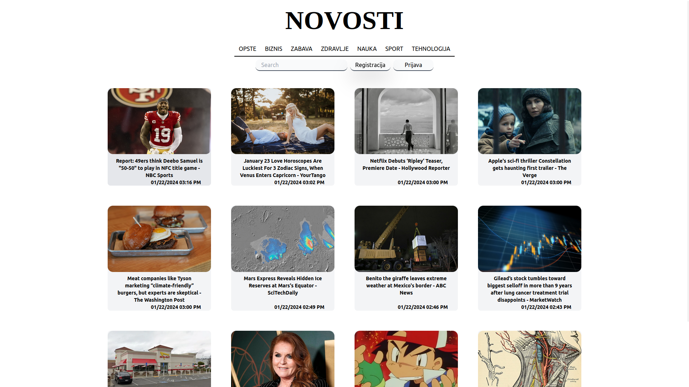
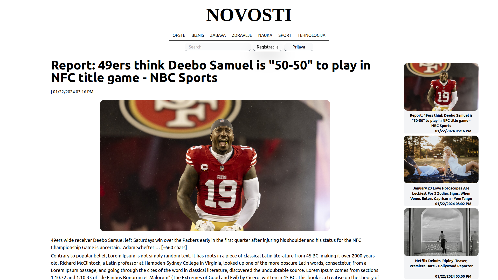
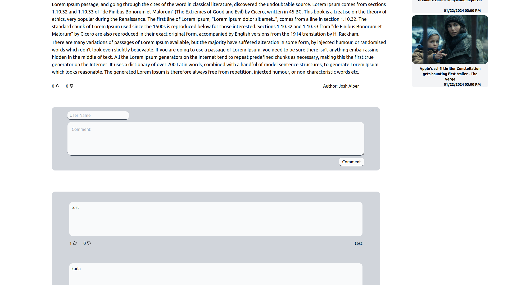

# Opis projekta

Full stack web aplikacija za portal elektronskih novina.
Funkcionalni zahtevi:
- Korisinici na portalu mogu da citaju vesti (prvo se prikazuju aktuelne vesti ali dostupna je i arhiva koja moze da se pretrazi)
- Vestu su definisane naslovom i tekstom (tekst moze da sadrzi slike, video linkove..). Svaki clanak pripada tacno jednoj rublici(politika, sport,tehnologija ...)
- Vest je moguce pretraziti po naslovu 
- Korisinik moze da lajkuje vest (like, dislike), moze da komentarise. Za ove akcije nije potrebna nikakva prijava, vec korisnik moze da unese jednokrato ime da postavi komentar. Takodje mozemo komentar da lajkujemo ili dislajkujemo. Takodje prikazujemo broj lajkova i dislajkova komentara i vesti.

Trenutno u izradi:
Da bi neko postavio vest potrebno je da bude registrovan:
- Novinar: moze da kreira novu vest u okviru neke rublike. Jednom kada je vest napisana cuva se u draftu. Dokle god je u ovo stanju novinar moze da je izmeni ili obrise. Kada zavrsi sa pisanjem salje je uredniku na pregled. I kada je posalje moze da je izmeni ili obrise. Kada urednik odobri tu vest novinar ne moze vise da pristupi promenama ili brisanju te vesti. Da bih novinar menjao nesto ili obrisao vest mora da trazi dozvolu od urednika. Novinar na registraciji bira kojoj ce rublici da pripada.
- Urednik: moze biti nadleza za jednu ili vise rublika ili moze da bude glavni urednik. Urednik rublike moze da odobri i brise samo clanke iz te rublike dok glavni urednik moze da radi sve.
- Glavni urednik moze da izmeni inforamcije novinara tjs kojoj rublici pripada, takodje moze da pretvori novinara u urednika neke rublike.

Tehnologije koje cu koristiti:

- Front-End: React, Tailwind CSS
- Back-End: Node js (Express)
- Podaci: mongoDB (mongoose)

Trenutni izgle stranice: 

